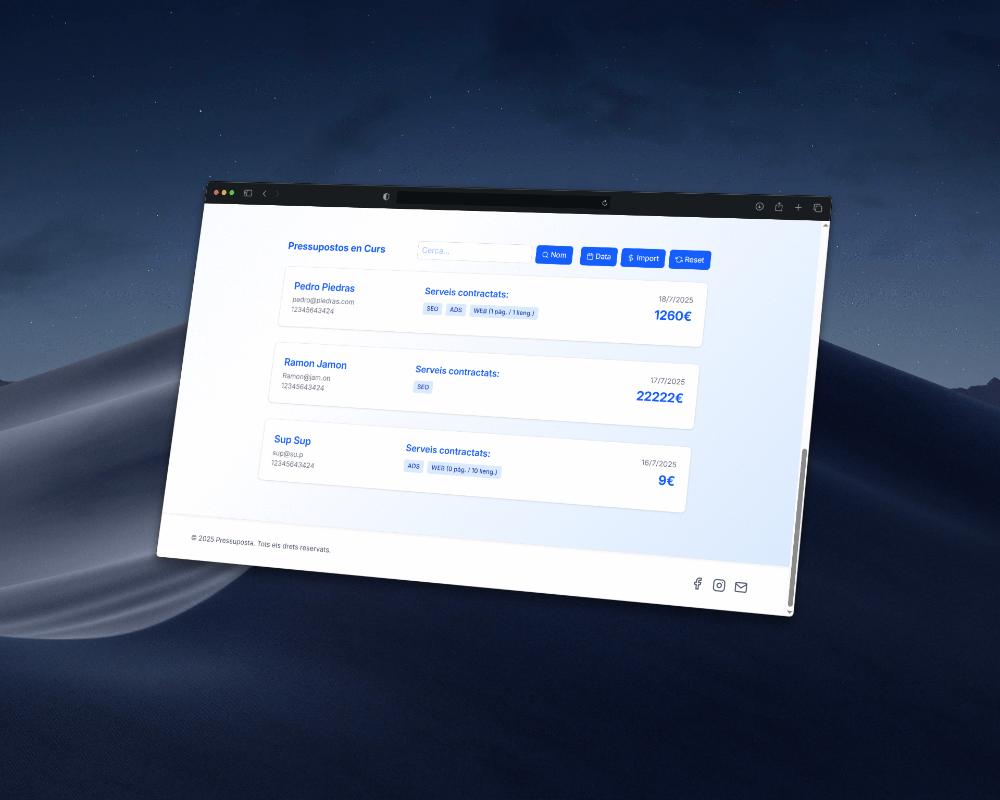

💰 Web Budget Calculator — Sprint 6



This project is part of Sprint 6 of the IT Academy Bootcamp. The goal was to deepen our understanding of React by creating reusable and scalable components that interact through props at different levels.

🚀 Technologies Used

- React (with TypeScript)

- React Router

- Vite

- Tailwind CSS

📌 Project Status
The MVP is complete and fully functional, except for the last exercise, which I couldn’t finish due to time constraints. Below is the timeline for this sprint: Sprint End Planned: 18-07-2025

🛠️ Getting Started

1. Clone this repo

```bash
git clone https://github.com/Clos266/web-budget-calculator
```

2. Install dependencies

```bash
$ npm install
```

3. Run the development server

```bash
$ npm run dev
```

📈 Future Improvements

- Implement testing. While I’m still solidifying core concepts, adding tests is a priority to ensure long-term maintainability and reliability.

- Add multilingual support. The app currently displays content only in Catalan — I plan to implement internationalization so it can be viewed in multiple languages.

- Refactor folder structure. Being my second React project and the first using React Router, the architecture evolved during development. A cleaner structure will improve clarity.

- Split complex components. Several files handle too many responsibilities; I’ll divide them into smaller, more focused units.

- Add smooth animations. Improving transitions and interactivity is on the roadmap, once the core functionality is solid.

- Enable budget sharing via URL. One of the final goals is to allow users to share a fully pre-filled budget via URL parameters. This enhances usability and supports real-world use cases, like sharing recommendations with others.
